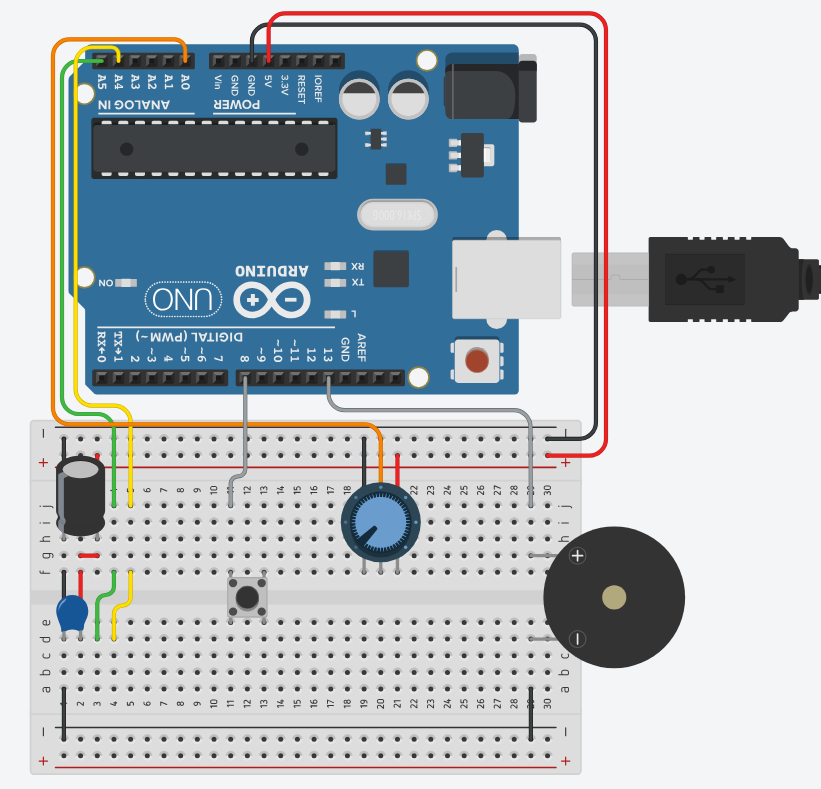
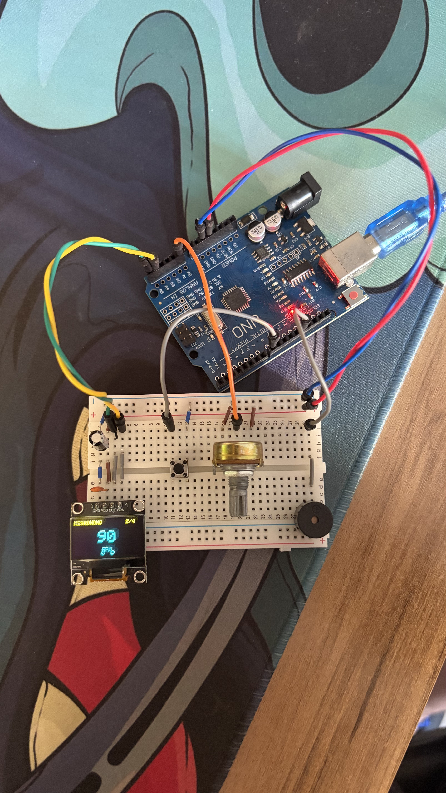

# 🎵 Metrônomo Digital

Metrônomo com BPM ajustável por potenciômetro (40–240), buzzer marcando o tempo
(com acento no primeiro tempo do compasso), botão para alternar entre os
compassos 2/4, 3/4 e 4/4, e display OLED mostrando o BPM atual e um indicador
visual de batida.

---

## 🔌 Pinagem

| Componente     | Pino Arduino       |
|----------------|---------------------|
| BTN Compasso   | D8 (INPUT_PULLUP)  |
| POT BPM        | A0                  |
| Buzzer         | D13                 |
| OLED SDA       | A4 (I2C)            |
| OLED SCL       | A5 (I2C)            |

---

## 🖼️ Esquemático




---

## 📦 Bibliotecas

- `Adafruit SSD1306`
- `Adafruit GFX`

---

## ⚙️ Como funciona

- O potenciômetro em A0 é lido com um filtro exponencial simples e mapeado
  para 40–240 BPM.
- O timing usa `millis()` sem `delay()` no loop principal — o próximo beat é
  agendado somando o intervalo ao agendamento anterior (em vez de resetar a
  partir de "agora"), evitando deriva de tempo.
- O primeiro tempo de cada compasso soa um tom mais agudo e longo (acento);
  os demais tempos soam um tom mais grave e curto.
- O botão em D8 usa debounce por detecção de borda e cicla entre os
  compassos 2/4 → 3/4 → 4/4 → 2/4, reiniciando a contagem do compasso.
- A OLED atualiza a ~20 FPS (cap de 50 ms) mostrando o BPM em fonte grande,
  o compasso atual e uma fileira de bolinhas indicando qual tempo acabou
  de soar.

## 📁 Estrutura

```
MetronomoDigital/
├── README.md
├── sketch_metronomo_digital/
│   └── sketch_metronomo_digital.ino
└── circuit_images/
    └── .gitkeep
```

---

*Desenvolvido por Felipe Grolla*
